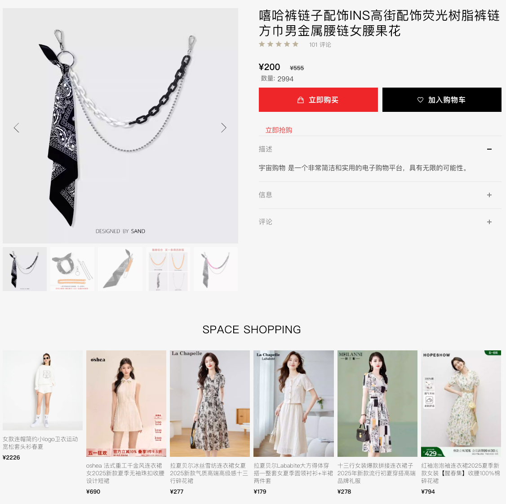
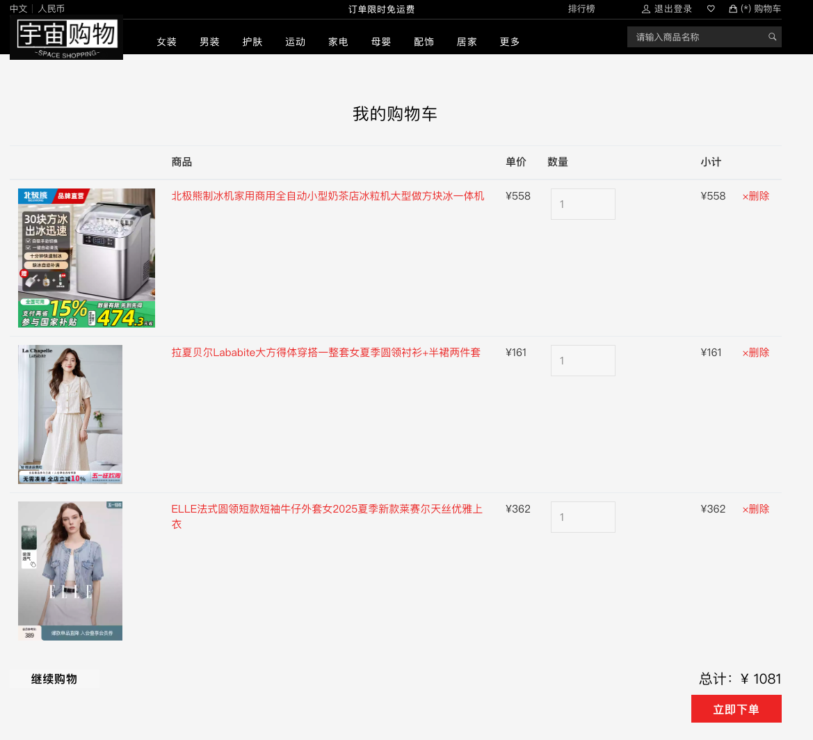
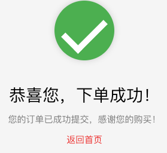
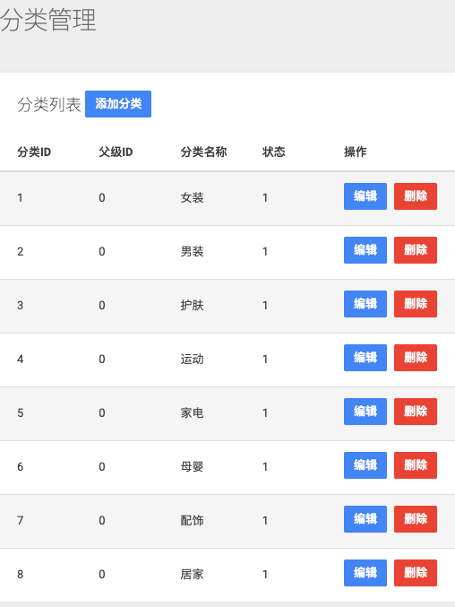

### 

>电商购物平台 & 管理后台（Go + Iris + MySQL + Redis + RabbitMQ + Nginx）

### 前后端一体化 Web 项目，从前端 UI、后端接口、数据库设计到上线部署。
* 这是我从零开始独立完成的完整的前后端一体化Web项目，从前端UI、后端接口、数据库设计到上线部署，都是自己亲手实现。
* 项目的目标是构建一个完整的电商流程：商品浏览、分类展示、购物车、订单流程，以及后台的商品管理、订单管理、用户管理等。

### 用户端界面展示
` “宇宙购物”（SPACE SHOPPING）的电商平台，整体风格现代、简洁、实用。`
* 瀑布流布局 & 搜索栏
* 
* 商品分类导航(多级导航栏)
* 
* 商品详情(加入购物车、立即抢购)
* 
* 高性能排行榜单
* 
* 用户下单(确认和生成订单)
* 
* 

` 页面的 UI 风格参考了大型电商平台（如淘宝、京东）的布局结构，整体结构清晰，视觉优雅。`

### 管理后台系统
`后台系统提供api管理全站信息，是自己设计的简洁的CMS管理平台。`
* 订单管理
* 
* 商品管理

`支持新增、编辑、删除商品，上传图片，设置库存、分类等。`
* 
* 商品分类管理

`查看商品分类明细和支持新增、编辑、删除等操作`
* 
* 用户管理

`查看用户列表、状态，支持冻结/启用。`
* 管理员管理

`查看管理员列表、状态，支持冻结/启用。`

### 技术栈
~~~
前端：
HTML + CSS + JS
部分页面使用 Vue 简化动态逻辑
管理后台基于 Admin 模板自定义开发

后端：
Go（Golang）
Iris Web 框架
MySQL（核心数据） + Redis（缓存 & session）
JWT 登录认证
RabbitMQ（异步消息）
Nginx（反向代理）

部署：
Ubuntu Server
systemd 服务托管（自动重启、日志收集）
Nginx 反代 / 静态资源服务
二进制打包发布，软链接切换版本（current → eshop_v2）
~~~

### 项目亮点
~~~
支持高并发的基础架构搭建
项目内集成了：
Redis 缓存
RabbitMQ 消息队列
Nginx 负载均衡预留接口
为将来扩展秒杀、异步通知等功能做了铺垫。
~~~
### 碎碎念
~~~
哈哈当然啦，在开发的整个过程还是有许多收获的。
例如加深对Go语言的熟悉程度、各种中间件和相互之间的如何应用、如何构建一个高可靠和高可用的系统、
在高并发条件下如何容错、如何解决数据可能丢失和学会排查系统错误、端口冲突、模板路径问题等等。
也许在不久还会有更多出色的应用，敬请期待吧~
~~~